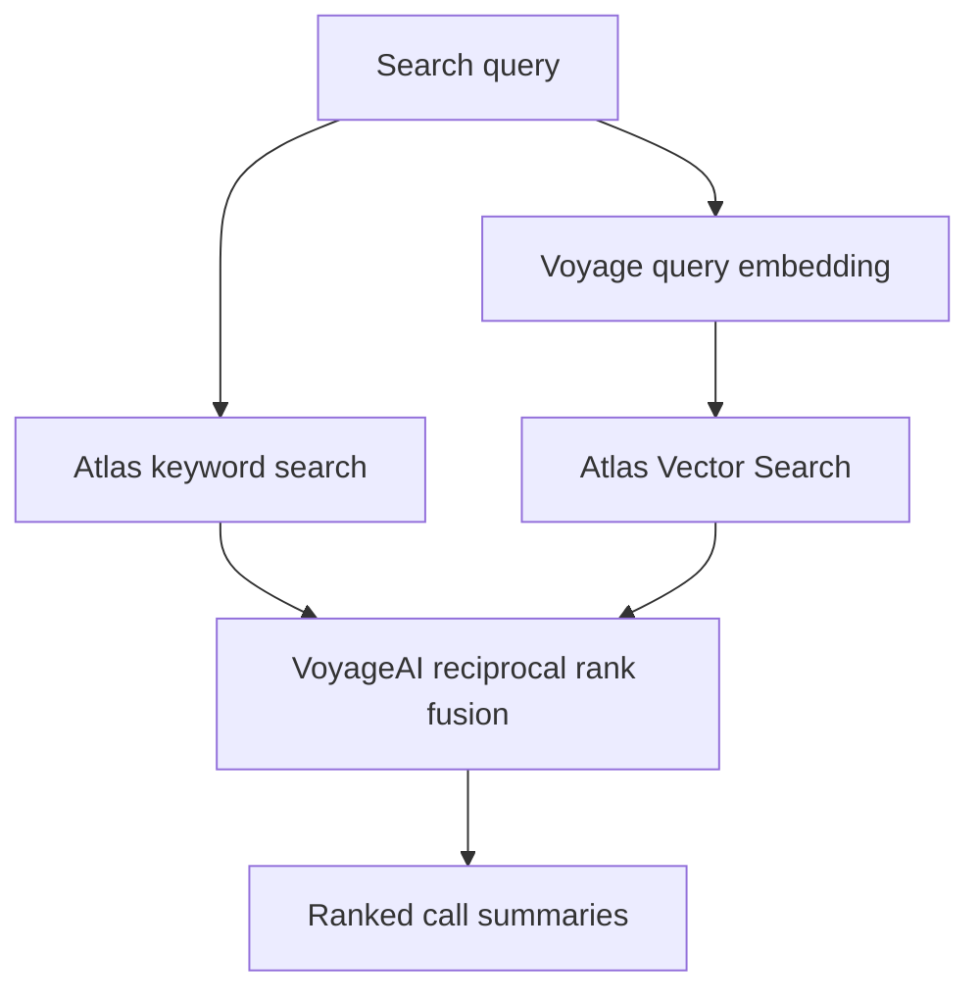

# Plan Benefit Transcript Summary Search

### From a benefits conversation to a searchable record.

A single-file Python and Streamlit demo that turns Agent/Patient call transcripts into structured summaries, embeds those summaries with Voyage AI, and retrieves relevant calls through MongoDB Atlas keyword, semantic, and hybrid search.

Watch OpenAI write the summary live. Follow the handoff to Voyage AI and Atlas. Then search by a specific benefit term or describe the situation in everyday language.

## What the demo shows

- Live summary generation, with the narrative appearing as OpenAI writes it.
- Structured extraction of benefits, costs, visit limits, follow-up actions, unresolved questions, and call outcomes.
- Voyage AI embeddings generated from the completed summary and its extracted details.
- Original transcripts, summaries, and embeddings stored together in Atlas.
- Keyword, semantic, and hybrid retrieval with adjustable weighting.
- Search results with summaries, source transcripts, and ranking details.
- A dark Streamlit interface with visible progress through each processing step.
- Two fictional calls included, plus an input for additional transcripts.

## The division of work

| Component | Responsibility |
|---|---|
| OpenAI | Summarizes the transcript and extracts structured details |
| Voyage AI | Embeds the summary-derived text and semantic search queries |
| MongoDB Atlas | Stores the documents and runs keyword and vector searches |
| Python | Validates summaries, coordinates processing, and combines retrieval rankings |
| Streamlit | Displays live processing and provides the search interface |

OpenAI is used during ingestion. Searching the stored summaries does not invoke OpenAI or generate a new answer.

## How hybrid search works

Both retrieval methods search the same summary-derived content. Atlas Search queries `search_text`; Atlas Vector Search queries its corresponding `embedding`.



The application retrieves up to 50 candidates from each method and combines their ranks using weighted reciprocal rank fusion, or RRF. The default is an even split between keyword and semantic retrieval.

For a document appearing in both result lists:

```text
hybrid_score = (1 - semantic_weight) / (60 + keyword_rank)
             + semantic_weight / (60 + semantic_rank)
```

Ranks start at 1. A document contributes only through the lists in which it appears. Fusion runs in Python; this implementation does not use the server-side `$rankFusion` stage. Raw keyword and vector scores are not added together.

## Run locally

The application lives in `plan_benefit_search.py`. Put this `README.md` beside it at the repository root.

Use Python 3.10 or later and your existing environment with Streamlit, PyMongo, Voyage AI, Pydantic 2, and the legacy OpenAI 0.x SDK. The script also uses `pydantic_core`, installed with Pydantic, for incremental JSON parsing.

This version deliberately uses `openai.ChatCompletion.create()` to preserve compatibility with the existing demo environment. It does not use the newer `OpenAI` client or Responses API.

Add your connection string and keys at the top of the script:

```python
MONGO_URI = ""
VOYAGE_API_KEY = ""
OPENAI_API_KEY = ""
```

Credentials are plain variables for this laptop demo. Keep these values blank in the copy committed to the repository.

Start the application:

```bash
python -m streamlit run plan_benefit_search.py
```

The Atlas database user needs access to read and write the demo collection and manage its search indexes. The laptop also needs network access to the cluster.

## Walk through the demo

### 1. Prepare the indexes

In the Setup tab, select **Create missing indexes**, then **Check connection and index status** until both indexes report `Queryable: True`.

The setup action creates missing indexes and reuses existing ones. Normal Streamlit reruns do not recreate indexes, and setup does not overwrite existing definitions. Both JSON definitions are also available in the Setup tab for manual creation in Atlas.

### 2. Process the calls

In the Calls tab, select **Summarize and store both sample calls**, or choose a single call and process it individually.

The interface shows three stages:

1. OpenAI streams the narrative summary and completes its structured output.
2. Voyage AI embeds the completed summary-derived text.
3. Atlas stores the transcript, summary, and embedding in one document.

The summary stays visible while embedding and saving finish. Only a completed, validated summary proceeds to embedding and storage; partial streamed text is displayed but never saved as a completed result.

To demonstrate generation again, select **Regenerate an already stored transcript**. Otherwise, an unchanged transcript with the same processing configuration is reused without additional summary or document-embedding API calls.

### 3. Search the summaries

Open the Search tab, choose Hybrid, Keyword, or Semantic, and enter a query. Adjust the maximum result count and the semantic weight to compare rankings.

Expand a result to inspect benefits, follow-up actions, unresolved questions, or the stored document. Select **View original transcript** to return to the source conversation.

New and updated documents may take a short time to appear in search results while the indexes catch up.

## Included conversations

All names, plans, providers, and benefit details in these calls are fictional.

| Call | Topics demonstrated |
|---|---|
| MRI coverage and estimated cost | Deductible remaining, coinsurance, conditional cost estimate, network status, prior authorization, and radiologist billing uncertainty |
| Physical therapy benefits and visit limits | Per-visit copay, shared PT/OT annual limit, used and remaining visits, referral requirements, and the separate authorization threshold |

Try these queries:

```text
MRI deductible and prior authorization
Does a different injury reset the therapy visit limit?
Which call discussed a $35 copay?
Patients who need approval before continuing treatment
Costs that were estimates rather than guaranteed amounts
Calls requiring follow-up with a primary care provider
```

With just two calls, semantic and hybrid search may return both. Add more transcripts to demonstrate meaningful relevance differences across a larger set of calls. Retrieval scores represent ranking signals, not confidence percentages.

## Atlas configuration

| Setting | Default |
|---|---|
| Database | `plan_benefit_search` |
| Collection | `call_summaries` |
| OpenAI summary model | `gpt-4.1-mini` |
| Voyage embedding model | `voyage-4-large` |
| Embedding dimensions | `1024` |
| Keyword index | `call_summaries_text` |
| Vector index | `call_summaries_vector` |
| Vector similarity | `cosine` |

The script explicitly selects the database and collection above, independently of any default database specified in the connection URI.

The keyword index maps `search_text` as a string using `lucene.standard`. The vector index maps `embedding` and includes filter fields for `embedding_model` and `embedding_dimensions`. Semantic retrieval filters on the configured model and dimensions.

## Document structure

Each document represents one transcript and its generated summary.

| Fields | Contents |
|---|---|
| `_id` | SHA-256 hash of the transcript after trimming leading and trailing whitespace |
| `transcript`, `source` | Original conversation and its input label |
| `title`, `patient_name`, `plan_name` | Extracted call context |
| `summary` | Narrative summary |
| `topics`, `benefits_discussed` | Searchable topics and benefit details |
| `follow_up`, `unresolved_questions`, `outcome` | Next steps, uncertainty, and disposition |
| `search_text` | Labeled text assembled from the structured summary fields |
| `embedding` | Voyage vector generated from `search_text` |
| `embedding_model`, `embedding_dimensions`, `summary_model` | Model metadata |
| `pipeline_signature` | Summary version, model names, and embedding dimensions |
| `created_at`, `updated_at` | Storage timestamps, not the original call date |

The transcript hash supports repeatable upserts. Regenerating the same transcript updates its existing document; editing its text produces a different hash and therefore a new document.

The summary prompt asks OpenAI to preserve qualifications and uncertainty, distinguish referrals from orders and authorizations, and omit member IDs and dates of birth from the summary. This is a prompting instruction, not a redaction guarantee. The original transcript remains intact in Atlas and is sent to OpenAI for summarization. Voyage receives the summary-derived text.

## Customize

Change the models, database, collection, or index names in the constants at the top of the script. Add conversations to `SAMPLE_CALLS` or paste them through the interface.

To change the page headline, find the `hero-title` element in `main()`:

```html
<div class="hero-title">Every call. Clearer context.</div>
```

If you change the embedding model, regenerate the stored embeddings before comparing results. Changing dimensions also requires a matching vector-index definition; the setup button does not modify an existing index. Increment `SUMMARY_VERSION` when changing the summarization prompt if previously processed calls should be regenerated automatically on their next ingestion.

## Troubleshooting

| Symptom | What to check |
|---|---|
| `cannot import name 'OpenAI'` | Use the version of this script that imports `openai` and calls `openai.ChatCompletion.create()` |
| `UnknownReplWriteConcern` mentioning `majority1` | Correct the URI option to `w=majority` |
| Index creation is unauthorized | Use a database user with search-index management permissions, or create the indexes manually using the definitions shown in Setup |
| An index is not queryable | Allow the build to finish and check its status again |
| A newly stored call is missing from results | Allow time for indexing, then repeat the search |
| An existing call does not stream a new summary | Enable **Regenerate an already stored transcript** |
| Stored calls are in an unexpected location | Check `MONGO_URI`, `DB_NAME`, and `COLLECTION_NAME` in the running script |

This demo retrieves what was discussed in calls. It does not independently verify plan coverage or make benefit determinations.
